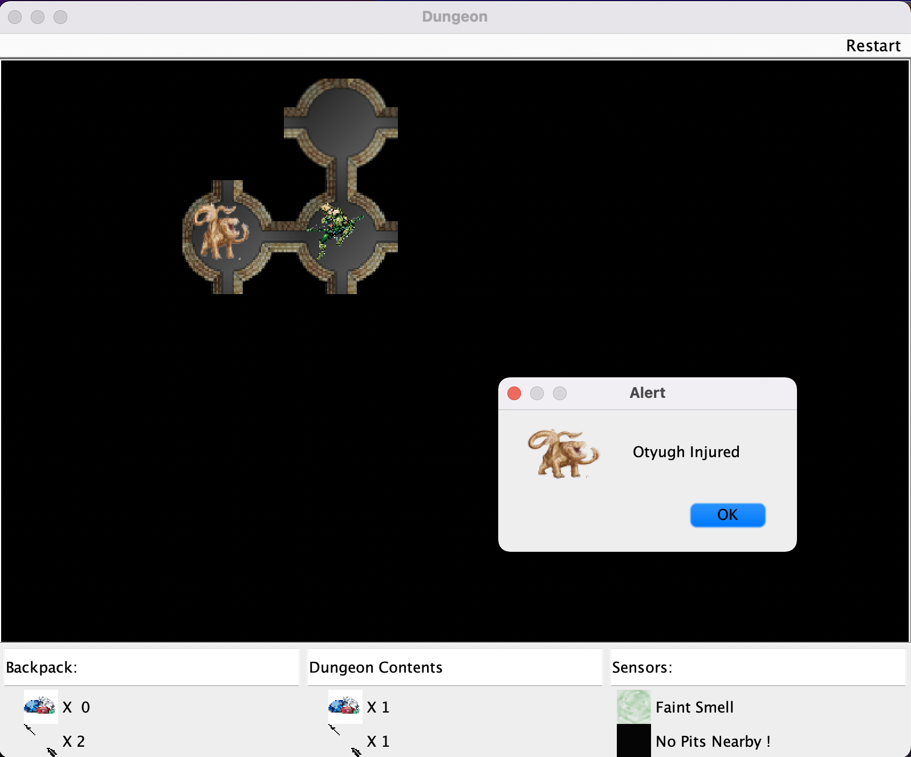
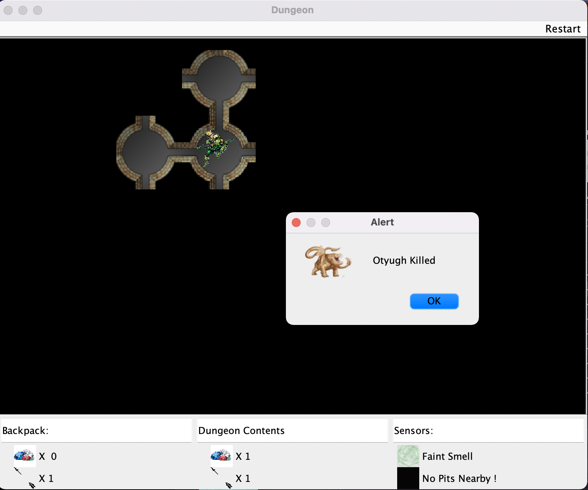

#README #
###Overview
The Project revolves around a game similar to pacman. Objective is to move the player around the maze collecting 
treasure on the way and reaching a destination. A dungeon is made up of nodes which are connected to each other by
edges. There always exists at least one path between any two Nodes chosen in the dungeon. The Game now has a Graphical 
user interface using Java Swing platform where we can show the dungeon and the 
corresponding functionalities in realtime.

###Design

The design of the project consists of a main interface Dungeon which interacts with the user and driver directly.
The implementation of dungeon i.e. 
KruskalDungeon is made up of objects from the following classes.
1. Node
2. Edge 
3. Player 
4. Movable
5. Otyugh
6. KruskalDungeon

A dungeon has a 2 dimensional grid of Nodes. The design handles two types of dungeons
1. Wrapping
2. Non Wrapping

We start with user input from driver which consist of 
1. Number of rows
2. Number of Columns
3. Interconnectivity
4. Treasure Percentage
5. Number of Otyughs

Based on the input the model creates a 2d Maze consisting of nodes.
Each node gets assigned a unique id and is initialized as isolated nodes with no connections.
On creation, we compute the potential paths based on the wrapping condition and use Kruskal's 
Algorithm to create a Minimum spanning tree with all nodes having interconnectivity 0. 

By modifying the same algorithm we are able to increase the interconnectivity to the specified value by the user.
Finally, we connect the nodes using the edges we get from the kruskal's modified algorithm.

Then we select two random start and end locations from the nodes as start and end of the dungeon which are at least 5
units apart from each other.

Apart from this in the next phase of the project few new features were added as follows:

1. Dungeon has a few Smelly Demons called Otyughs which are spread out in caves and have an appetite involving fresh meat. 
2. A dungeon has at least one Otyugh at the end of the dungeon.
3. Players are equipped(start with 3 arrows) with arrows which can be shot at the otyugh to kill them. 
4. It takes 2 arrows to kill an otyugh.
5. Arrows are also collectables which are found all over the dungeon and can be picked by Player in the same frequency as that of treasures.

The next phase also includes an addition of a controller to the model which was designed. The controller takes input 
from the user and performs the corresponding function in the model when possible and handles all the exceptions by 
catching them and sending it to the user via the output console.

Apart from this in the last part of the project we have added a few additional features to the dungeon

1. Pits all around the dungeon which will suck you in unless you trade with your treasure.
2. A Thief who steals all your treasure when encountered.
3. A Ninja who sneaks up on you and only way out is to fight him hand to hand.
4. We have included a poison arrow which will kill the monster instantly and consumes 3 normal arrows.

###How To Run

The program has an executable file(JAR). To run the file we need to run the following command in a terminal.
The program can be run both using the Text version and the Graphical version.
It is decided during runtime. If there are no arguments given when running the JAR file the graphical version of 
gameplay start and when the arguments are given it switches back to the Text version.
<code>
java -jar (path)/(filename).jar (arguments)
</code>

Arguments needed to be given are 
1. number of rows
2. number of columns
3. interconnectivity
4. true/false for wrapping
5. Treasure percentage
6. Number of Otyughs
7. seed for testing(0 if you want it to be random)

Example command line to run:

1. For  text based version:
   <code>java -jar Project5.jar 6 8 4 true 40 3 0</code>
2. For Graphical version:
   <code>java -jar Project5.jar
   </code>

Run of the program follows the following format.
1. Welcome Message
2. Destination node
3. Dungeon in a visual Text format with player Highlighted.
4. Starting Node
5. Loop of Game begins which contains the following 
   1. Current Location
   2. Contents of the Node
   3. Asks player for the choice of functionality to perform (Move, Shoot, Pickup, Player description, Quit)
      1. If choice is move it shows the movable directions and ask user to choose.
      2. If choice is Shoot it asks the user for direction and distance to shoot.
      3. If choice is pickup it shows the contents of the node and asks user for choice if available.
      4. If choice is Player Description, It displays the player name, contents of backpack and location.
      5. If choice is quit, the game ends.
6. The loop ends either when quit is selected one the following happens:
   1. Player wins the game
   2. Player gets eaten by an otyugh.

Let's go through some Example functionalities in the Graphical version:

1.When we start the game we get an Argument JFrame which takes the arguments 
to create a Dungeon.

2. After taking the inputs we get a welcome message with information regarding the gameplay, controls and features in the game.

3. After the welcome message you are redirected to the main screen with two JFrame windows i.e. the Dungeon window and the controller window.

4. After this the game starts and the player has to reach the destination navigating his way through the maze.
5. The player has to always keep an eye on the information panel to see the contents of the node and keep track of his backpack.
   
6. The player is informed of an otyugh nearby by the pungency sensor in the information panel and a sound alert.
7. When a player encounters a ninja, he fights him in a duel with a 50/50 chance to win.
     
8. When a player shoots and injures an otyugh the otyugh location is revealed and when he kills it the otyugh disappears.
    
9. When a player steps into a pit he is given a choice to trade with his treasures or be sucked into the pit.
    
10. When a player manages to defeat the otyugh at the end and win the game the game ends with a message.
    
11. When a player gets eaten by the otyugh at the end game ends with an alert.
    
12. The game has sound effects for many of the moves and alerts and is best experienced with headphones.
13. The game has option to restart the game in the menu bar on top which gives options to restart the game with
    1. Same arguments 
    2. New arguments
       

   

###Design/Model Changes
 Changes were made to the design to include the new features of the next phase and which was done by the following steps:
1. New View and controller for the Graphical User interface.
2. Added new features such as Thief, Pit, Ninja and a poison shot to the game.
3. Corrected the design flaws as per the evaluation.
###Assumptions 
We have assumed the project to denote only the model and controller phase of the project and will in incremental 
phase handle view separately. We have assumed that there can be only one player in the dungeon ata a time.
We have assumed that there is no time restriction for the movement. We have also assumed that the monsters dont move
around the dungeon or follow a player.

###Limitations
1. Limited functionality due to outdated Java swing platform.
2. Does not have a very good visual experience with animations for movement of arrows and monsters.

###Citations
* https://www.geeksforgeeks.org/
* https://www.stackoverflow.com
* https://java2blog.com/
* https://www.tutorialspoint.com/
* www.cs.utsa.edu
* https://www.youtube.com/channel/UC4SVo0Ue36XCfOyb5Lh1viQ
* https://www.javatpoint.com › java-swing

These websites have been really helpful for learning and implementing new data types and functionalities in the prioject.
They have helped me to refine and redesign the project to best fit the requirment.